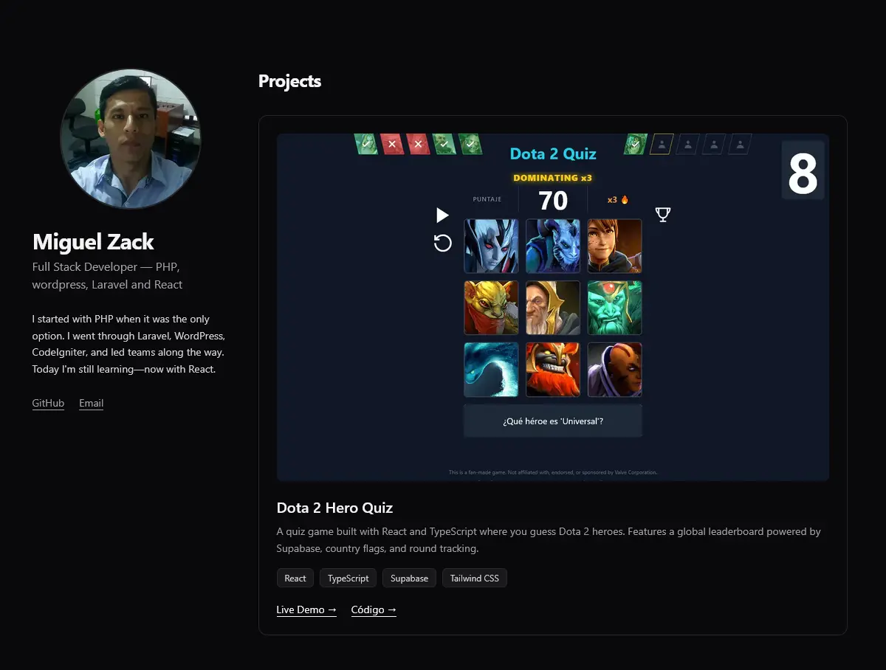

# 🚀 Portfolio - Miguel Zack

My personal portfolio built with Astro. Focused on performance, clean design, and scalable code.

**🌐 Live:** [miguelzack.vercel.app](https://miguelzack.vercel.app/)

## 📸 Screenshots

## ✨ Features

- **Performance 100** en Lighthouse
- **0 JS innecesario** - Astro islands architecture
- **Responsive** - Mobile first
- **Dark mode** nativo con Tailwind
- **SEO optimizado** - Meta tags, OG images

## 🛠️ Stack

| Tech | Uso |
| --- | --- |
| **Astro 5** | Framework principal, SSG |
| **TypeScript** | Tipado y mejor DX |
| **Tailwind CSS** | Estilos utility-first |
| **Vercel** | Deploy y analytics |

